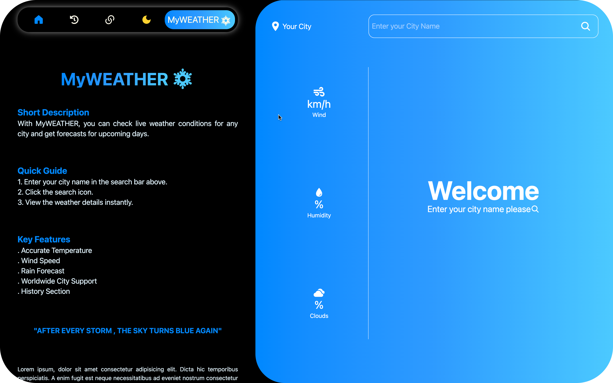
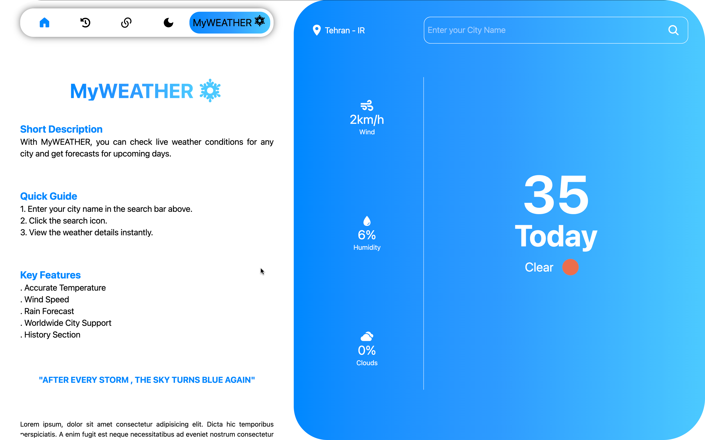
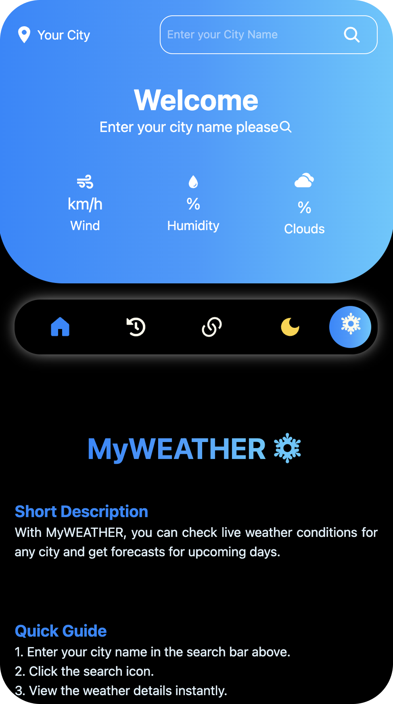
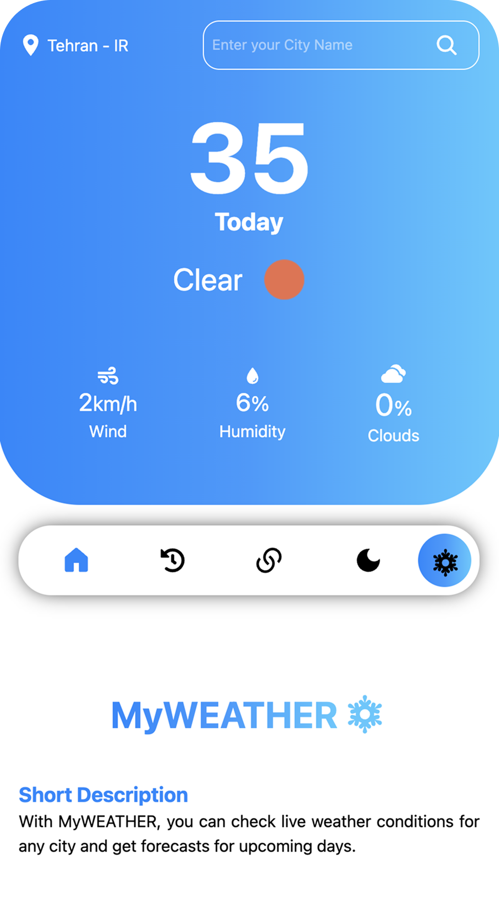
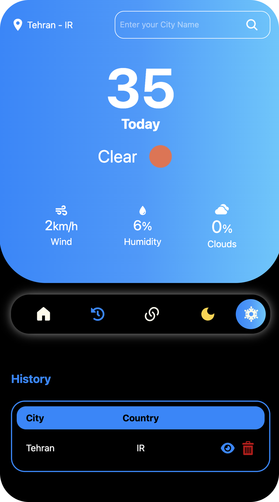

<h1 align="center">Weather App</h1>
<p align="center">  A modern weather application to display the current weather in different cities around the world.</p>


<br/>
<br/>

 
## Live Demo  
[Open the Live Website](https://weather-app-five-chi-91.vercel.app/)

<br/>

## Description
A modern weather application, Weather App is a simple application to display the current weather in different cities around the world.

<br/>

## Note
This project uses a third-party weather API. If the application doesn't work or weather data isn't displayed, it may be due to internet restrictions or temporary inability to access the API, resulting in no response from the server.

<br/>

## Features
- History
- Search history with one-click access to previously searched cities
- Search for cities and display current weather conditions
- Shows temperature, humidity, wind speed, and sky status (clear, cloudy, etc.)
- Error Alert
- Light Mode - Dark Mode (Default => Dark)
- Persistent Theme Preference (via localStorage)
- Loading spinner
- Simple and responsive user interface
- Support for temperature units
- Mobile view support
- Uses OpenWeatherMap API
  
<br/>

## Screenshots
###### Desktop


<br/>



<br/>

###### Mobile
<table>
  <tr>
    <td></td>
    <td></td>
    <td></td>
  </tr>
</table>

<br/>

## Tech Stack
- React.js
- Tailwind CSS
- React Query
- OpenWeatherMap API
  
<br/>

## Installation & Usage
###### Requirements 
- Node.js
- npm or yarn
###### Installation Steps 
1. Clone the project 
```bash
git clone https://github.com/KavehKhorshidiii/weather-app.git
```
2. Move into the project directory
```bash
cd my-app
```
3. Install dependencies
```bash
npm install
```
4. Run Tailwind in watch mode
```bash
npx @tailwindcss/cli -i ./src/input.css -o ./src/output.css --watch
```
###### Usage Steps
Start the development server
```bash
npm start
```

<br/>

## Project Goals
- Practice building applications with React.js
- Learn and apply React Query for data fetching and caching
- Improve frontend development skills with TailwindCSS
- Learn how to integrate and consume third-party APIs (OpenWeatherMap)
- Improve error handling and user experience in real-world scenarios
  
<br/>

## TODO (Next Steps)
- [ ] Add unit testing (using Vitest or Jest)
- [ ] Switch between Celsius and Fahrenheit units
      
<br/>

## License
**Proprietary code – do not use without permission.**

<br/>

## Author

**Kaveh Khorshidi**

[](https://github.com/kavehkhorshidiii)

[](mailto:kavehkhorshidiii@gmail.com)
